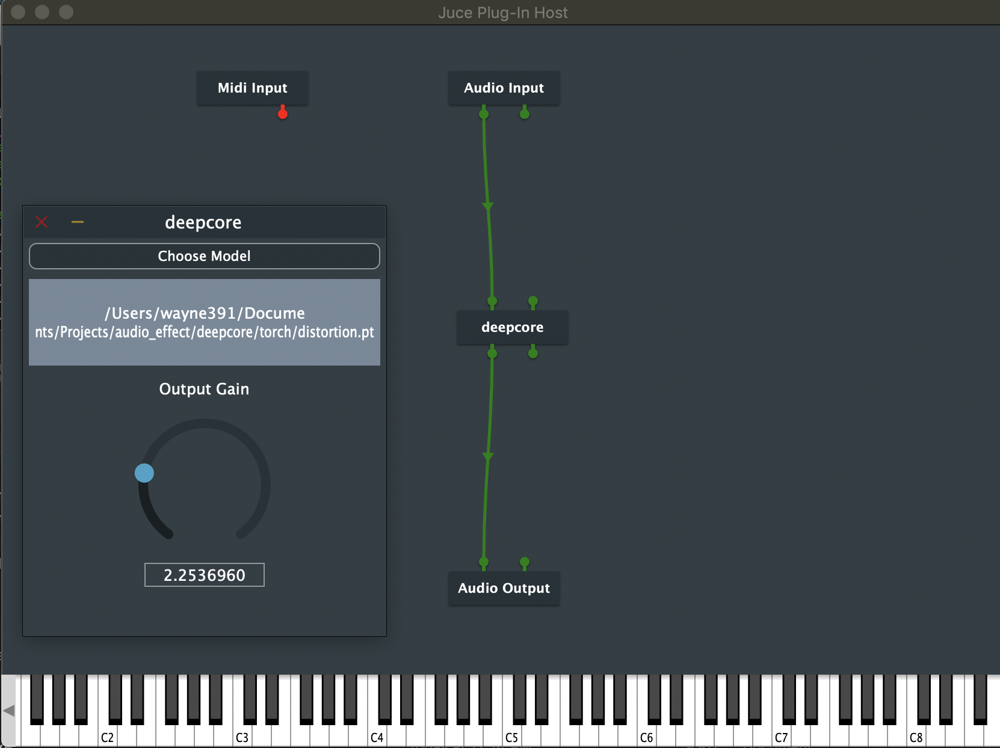

# TorchLite Plugin

This repo demonstrate how to compile JUCE with libtorch (pytorch C++ library), and run on jitted torch models. 


## A. Prerequisite
### Clone the Repository
```bash
$ git clone --recursive https://mastertones@github.com/mastertones/torchGAIN.git
```
### External Libraries
#### Intel MKL-DNN
* Intel MKLDNN (version: [0.20](https://github.com/intel/mkl-dnn/releases/tag/v0.20))
* Intel MKLML (https://anaconda.org/anaconda/mklml) by anaconda. (NOTE: This issue is temporary solution for installing MKLML.)

## B. Compilation

### Requirements
* cmake
* C++ version: **14**
* JUCE v5.4.5
* libtorch v1.3.1

Please arrange all the requirements as the structure of this repo. You can download the backup versions of JUCE and libtorch from [here](https://drive.google.com/file/d/1xHXffHHR1lOs_j3DafMnouLKGxg9sLD9/view?usp=sharing).


### Using Xcode
***Warning: Xcode failed in building with pytorch. The flags setting is too complicated. If source codes contain torch dependencies, I recommend to use FRUT.***

### Using FRUT
1. Install [FRUT](https://github.com/McMartin/FRUT/blob/master/README.rst)
    * Run `install_FRUT.sh`
    * **Remember to set the JUCE path in the script *(default: "-DJUCE_ROOT=../../JUCE")***
    * If failed, check out the orignal [repo](https://github.com/McMartin/FRUT/blob/master/README.rst).

2. Generate `CMakeLists.txt`
    * General Cases  
    **remember to set the path to JUCE modules**
    ```bash
    $ cd Project
    $ ../FRUT/prefix/FRUT/bin/Jucer2Reprojucer deepcore.jucer ../FRUT/prefix/FRUT/cmake/Reprojucer.cmake --juce-modules=<path-to-JUCE-moduls>

    Project/CMakeLists.txt has been successfully generated.
    ```

    * With libtroch (optional)  
    Add the following codes into generated `CMakeLists.txt`:
    ```bash
    # add
    set(CMAKE_PREFIX_PATH "../libtorch")
    find_package(Torch REQUIRED)

    # ...

    # modify
    jucer_export_target(
        "Xcode (MacOSX)"
        EXTERNAL_LIBRARIES_TO_LINK ${TORCH_LIBRARIES}
        )

    ```

3. Build
    ``` bash
    $ cd Project
    $ mkdir build && cd build/
    $ cmake .. -G "Unix Makefiles"
    $ cmake --build .
    ```

## C. Available Effects

* Bypass: do nothing 
* Distortion: hard clipping (0.5) + abs
* Gain: multiply 0.01
